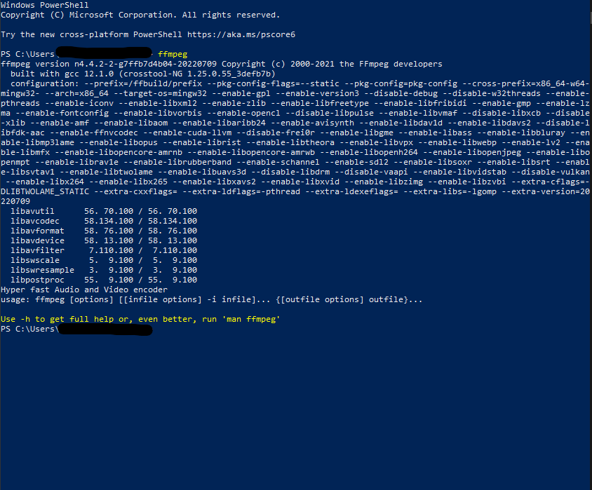
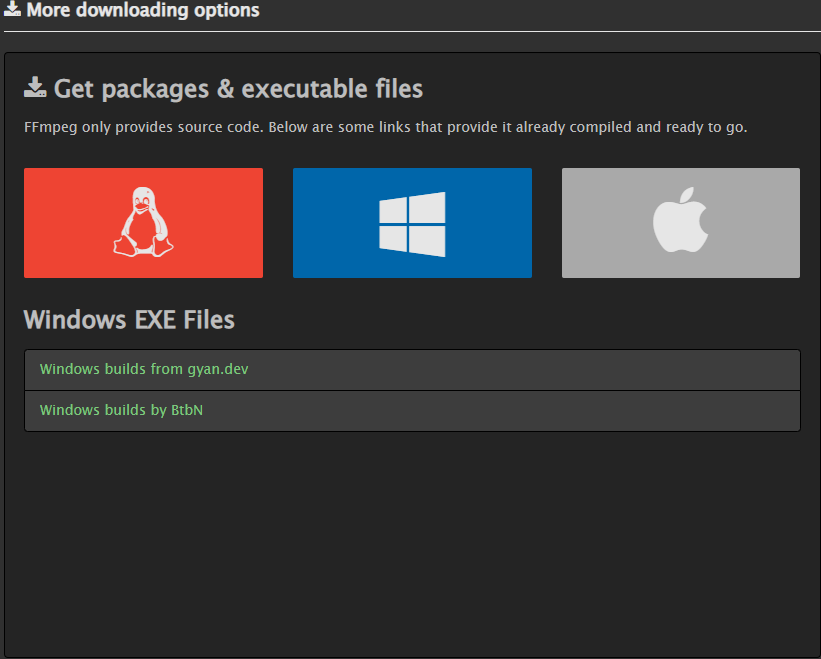
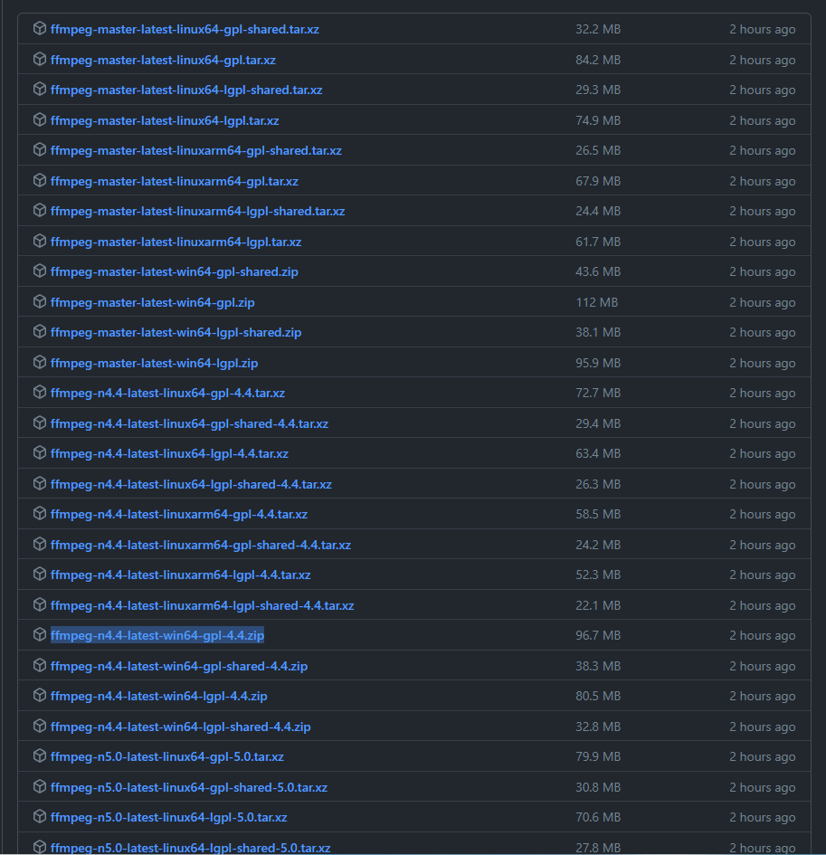
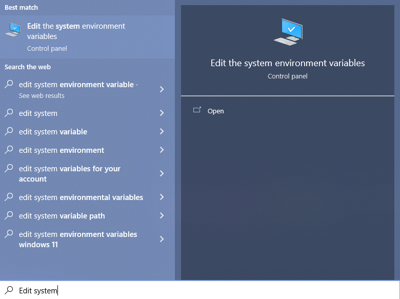
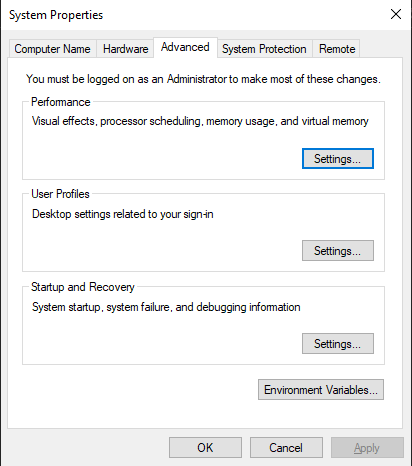
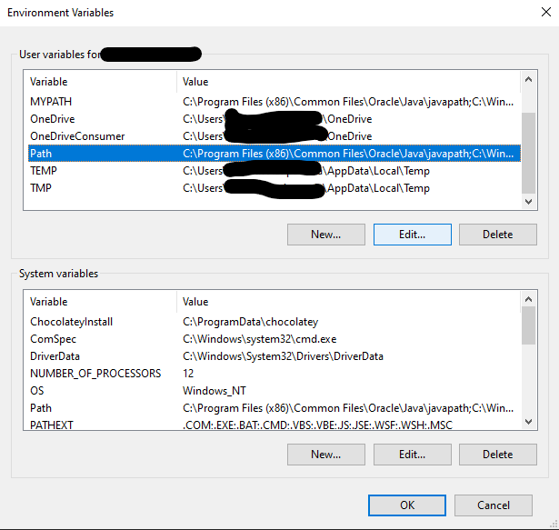
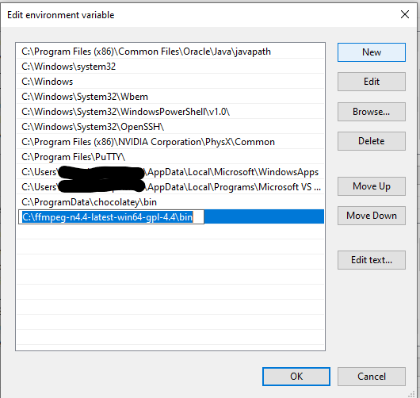

# Guide to Installing FFmpeg

## FFmpeg Windows Install 
<br>

### Install With Package Manager (Recommended)<br>

Installing FFmpeg with a package manager has many benefits such as updates and support for FFmpeg and ease of management. 

Windows has an open source CLI Package manager called [Chocolatey](https://chocolatey.org/). You can follow the instructions for individual install [here](https://chocolatey.org/install#individual) or follow the directions below.

***You will need Administrative Privilege for this Install***

1. Start up an Administrative PowerShell session, you can do this by right clicking the PowerShell application and hitting *Run as Administrator*

2. Paste in the following command to the PowerShell prompt:

```powershell
Set-ExecutionPolicy Bypass -Scope Process -Force; [System.Net.ServicePointManager]::SecurityProtocol = [System.Net.ServicePointManager]::SecurityProtocol -bor 3072; iex ((New-Object System.Net.WebClient).DownloadString('https://community.chocolatey.org/install.ps1'))
```

3. Let the command finish executing and no errors pop up you should successfully have Chocolatey installed!

4. To install FFmpeg type the following into the PowerShell prompt:

```powershell
choco install ffmpeg
```

5. Wait for the command to finish executing and when it returns to the prompt check to see if FFmpeg is installed by typing `ffmpeg` into your prompt. You should get an output similar to the following.



### Install Without Package Manager (Not Recommended) <br>

1. Click the following [link](https://ffmpeg.org/download.html#build-windows) and navigate to *More downloading options* and click the Windows logo. From there click *Windows builds by BtbN*.



2. There are going to be a lot of different files to sort through, if you want to find your own build to download just make sure it is a Windows specific build. Otherwise you can choose the latest stable release and download `ffmpeg-n4.4-latest-win64-gpl-4.4.zip`



3. Save the zip file to any folder you would like, however I would recommend saving in your home folder `C:\Users\yourusernamehere\` or the root folder `C:\` if you have admin permissions. Go ahead and unzip the folder after you have saved it. <br>

4. In order to use FFmpeg from the command line you need to add the bin folder located in the folder you just unzipped. This can be done by hitting the windows key and typing; `Edit system environment variables` which should pop up after the first two words or so. Hit enter when this control panel setting pops up.



5. From there navigate to the *Advanced* tab and hit *Environment Variables...*.



6. Under *User variables for yourusername* click the *Path* variable and hit edit.



7. In the new window hit the *New* button and then paste in the entire path of the FFmpeg download folder but append `\bin` to the end of it. Hit *OK* on all open the open windows to save your configuration. The following example assumes you have saved the folder in your root `C:\` directory.



8. You should now have FFmpeg installed and added to your Path. You can confirm this by opening PowerShell and typing `ffmpeg`, the output should similar to the one below.


<br>

---
<br>

## FFmpeg OSX Install 
<br>

### Install With Package Manager (Recommended) <br>

Installing FFmpeg with a package manager has many benefits such as updates and support for FFmpeg and ease of management. 

OSX has a open source CLI package manager called [Homebrew](https://brew.sh/). Installation is extremely simple.

1. Paste the following command into your terminal.

```bash
/bin/bash -c "$(curl -fsSL https://raw.githubusercontent.com/Homebrew/install/HEAD/install.sh)"
```

2. Wait for the command to finish executing. If no errors have occurred you have Homebrew successfully installed. You can test this by typing out `brew` into your terminal.

3. To install FFmpeg paste the following command into your terminal.

```bash
brew install ffmpeg
```

4. Wait for the command to finish executing. If no errors have occurred you have ffmpeg successfully installed. You can test this by typing out `ffmpeg` into your terminal. The output should look similar to the following.

<br>

### Install Without Package Manager (Not Recommended)

***If you are using an M1 Mac there are no static builds for ARM processors and you will have to use rosetta or find some other workaround.***

1. Click the following [link](https://ffmpeg.org/download.html#build-mac) and navigate to *More downloading options* and click the Apple logo. From there click *Static builds for macOS 64-bit*

2. You can either download the most recent compile from the continuous updating github or the most recent release. Either is a fine option and you can download either the .7z or the .zip which is located just below the big .7z download button. **If you have no preference I would suggest downloading the most recent release, which is `ffmpeg-5.0.1` and I would download the .zip to make extracting the file easy.** 

3. When saving your download I would suggest saving the folder in your home directory which would be `/Users/yourusernamehere`. Go ahead and extract your download as well, you can do this by right clicking the file and hitting extract. 

***You will need admin privileges to do the following***

- From here open your terminal and navigate to where you saved your folder. From there you can copy the ffmpeg binary from the `./bin` folder and copy it into the `/usr/share/bin`. The command would look similar to the following from the root folder of the FFmpeg folder. 

```bash
sudo cp ./bin/ffmpeg /usr/share/bin
```

***If you do not have admin privileges to do this or would rather not have to use admin you can also acheive this by editing your shell startup file in order to include the ffmpeg folder.***

- To find the shell you are using run the following command: 

```bash
echo $SHELL
```

- The output should give you the path to your shell. From there you can edit your startup file using the following command:

```bash
echo "export PATH=\"/full/path/to/ffmpeg/folder/bin:$PATH\"" >>  ~/.zshrc
```

Or if your shell is bash:

```bash
echo "export PATH=\"/full/path/to/ffmpeg/folder/bin:$PATH\"" >>  ~/.bashrc
```

4. Exit the terminal and startup a new window. Type `ffmpeg` into the command line and if the output is similar to the following it is successfully installed. 

<br>

---
<br>

## FFmpeg Linux Install 
<br>

Linux install is incredibly easy. Most native Linux package managers have FFmpeg in their repos. Simply use the install command for your package manager and append `ffmpeg`. Samples below:

Debian/Ubuntu
```bash
sudo apt install ffmpeg
```

Redhat
```bash
sudo rpm install ffmpeg
```

Fedora
```bash
sudo dnf install ffmpeg
```

CentOS/Derivatives
```bash
sudo yum install ffmpeg
```

Arch/Derivatives
```bash
sudo pacman install ffmpeg
```
